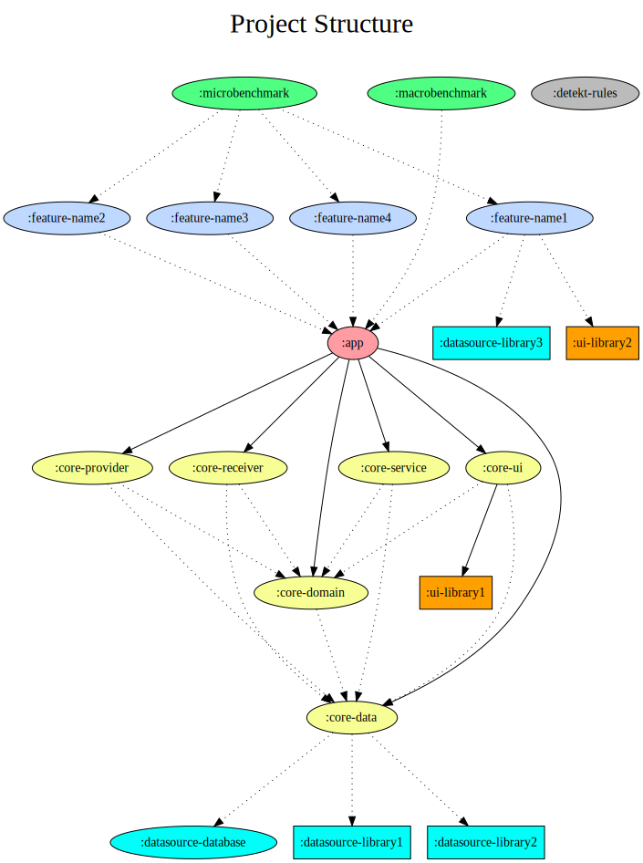

# Project structure

This document was based and any omissions should be referred first to the official Android documentation, then language documentation, industry standards, Computer Science literature, and community.

This document describes the concerns of modules, packages, files, classes, and etc. from the project, as well as the architecture.

It was also used as reference for the architectural division the project `nowinandroid` and `iosched`.

## Architecture

The architecture proposed here follows the [Guide to App Architecture ](https://developer.android.com/topic/architecture) by the Android Developers Team.

It divided in three layers:  
 - Data
 - Domain
 - UI / services

NOTE: provider and receivers were a mistake. They are components of the Data layer, not layers themselves.

It uses principe of Separation of Concerns (SoC) to further separate the UI layer views classes (activities, fragments, and views) from the view models. 

It also separates repositories and models from data sources classes, like entities and remote resources. 

This architecture is enforced by the modules dependencies and kotlin visibility modifiers.

The pieces of this the architecture are connected to each other using mostly the publish-subscribe pattern, with the implementation done using coroutines, specially `Flow`s, in a *reactive* manner.

The stream of data flows from the data layer to the UI / Service when it's consumed and the opposite when it's inserted.

The top layer, the *data layer*, don't see the other layers, while the *domain layer* don't see the *UI / service layer*.

The ones on the bottom always see the ones on the bottom.

### Objectives of the architecture

The architecture was created keeping in mind the follow objectives:

- Less development errors
- Less runtime errors
- Less compile time
- Easy testing
- Faster testing
- Easy project navigation
- Low learning curve of the project
- Smaller download size and faster install
- Less merge conflicts while concurrent developing
- Smaller maintenance costs
- Smaller time to market

## Modules

The modules are separated in *core8 for shared resources and *feature* modules for specific functionalities. Additional modules for testing and benchmarking are also added.

The core resources are divided by architectural layer. This structure guarantee two things: enforce the Separation of Concerns of the architectural layers and make the number of modules stable during the lifetime of the architecture, since the architectural layers are stable.

The final package structure is as follow:

    :app
    :core_data
    :core_domain
    :core_service
    :core_ui
    :datasource_database
    :datasource_[datasourcename]
    :feature_[featurename]
    ...
    :macrobenchmark
    :microbenchmark

???
Maybe receivers and providers should not be a core_module as they are not architectural layers, but instead they allow the app to receive and provide data in the platform, working as pieces of data source, analogous to the database and api clients classes. The difference is that database and api clients works with pulling data, while receivers works by data being pushed. Receivers most likely will modify the database in `:core_data`, which will notify the UI that observes that data and providers will receive requests and call `:core_data` repositories to gather it. The currently structure serves this purposes well, example:

1. `:app` can access and register a SyncReceiver in `:core_receiver`  to listen to push notification
2. A sync push notification arrives stating in the message that table `product` should be updated.
3. `:core_receiver` BroadcastReceiver can access and use UseCase in `:core_domain` to call syncProductTableUseCase();
4. `SyncProductTableUseCase(databaseRepository, networkRepository)` can see it's repository dependencies in ":core_data", so it performs the tasks of fetching new data from network and update database. This can also be done in a sync service, but for the sake of example we pretend that there is no sync service;
5. `:datasource_database` ProductDataSource notifies observers of `Flow<List<entity.Product>>` in `:core_data` ProductRepository;
6. `:core_data` ProductRepository map the Flow to Flow<List<model.Product>> in `:core_domain`, which is observed by ProductsViewModel in ':feature_catalog' since it can see `:core_domain` from `:app` since they are api gradle dependency on `:app`;
7. `:feature_catalog` ProductsViewModel emits a UiState : StateFlow with a Success(data) message to fragment;
8. Fragment updates the adapter and user sees updated catalog.

Note that if a core receiver wants to start a core service, it will have to start it indirectly. In the case of SyncService, this can be accomplished with ContentResolver.syncRequest(), which is the standard way. There is other ways to start services without actually seeing the class, it's not the most elegant, but it is possible and used in some implementations of dynamic feature.

The proof of concept will help clarify definitely where those two should be placed. For now, I believe that they are in the correct place. 
???

??? 
Merge the cores UI services into :app may be necessary because they can't see each other. A activity in core_ui cannot start a service, but maybe this our intended behavior since core_ui should be pieces used by other modules. If an activity in core_ui wants to start a service, they should have defined the service in core_ui, but it should not be usually the case. :core_ui should not have non abstract or open activities, but mostly views and at maximum fragments.

Services talk to activities with messages and IBinders, so they don't need to see activities at all, just the activities that need the message scheme.

???

As bonus, the prefix core and feature make the alphabetic order also order the modules by importance, with test modules grouped at the end.

Network classes for accessing Web APIs (including remote resources classes), from the company or not, should be placed in a different project and added as dependency of the module that uses it (preferably with a repository pattern usually in `:core_data`). But these network classes also can be put on `:datasource_thenameoftheapi` module if you want to protect its use.

### app

Holds the Application class, application theme, and other resources related to the application scope as well the MainActivity.

Contains also the dependency injection classes for building the app, like the main module, in a file called di.kt.

### core_data

Contains models and repositories, but not data classes auxiliary to the UI or domain layers.

### core_domain

Contains the shared use cases classes, auxiliary classes, and extensions, including the abstract and open UseCase base classes.

### core_service

Contains the shared Android `Service` classes and auxiliary classes and extensions.

### core_ui

Contains the shared helpers for UI and components but that was considered too specific to be part of the `rs.lib.ui_android` project.

### datasource_database

Contains the Room Database, DAOs, and entities. It should not be visible to feature modules as feature should access it indirectly with a repository pattern.

Note that even though `Room` entities can be used in the UI, and therefore why we don't have *JPA* features like `@OneToMany` and etc, we separate model from entity because we cannot control the object that come from other data sources, like a *Google REST API* resource. The idea is, independent of the data source specific structure, our repository will deliver the same normalised model.

This slightly differs from the `nowinandroid` project approach, that reuses the `Entity` as model and for that further modularize the `:datasource_database` module into one for the entities and other for the database / DAOs.

The advantage of `nowinandroid` approach is small number of data classes. 

The main advantage of our approach is more freedom for changing models to suite our business needs without have to worry about impacts on SQL structure. It's also makes more simple to control modifications by developers of this delicate part of the system, which in general should be modified only by developers with more experience and after proper careful evaluation. It also gives us the option to use an implementation of a persistence framework with the `JPA` like features. Lastly, it has a more simple and consistent project structure, with the `:datasource_database` module behaving just like any other data source module, for example an API client, another application provider, a system provider, and etc.

This package will centralise all the database classes as many queries are done more efficiently with SQL `join` operations and, as today, there is no advantages in dividing the database for the point-of-sale project.

### datasource_[datasourcename]

It may contain API clients, resource data classes, and other classes used to access data. This module is added as dependency of `:core_data` and it's not visible to other modules. It can be added directly to a feature module. See graph dependency.

If the datasource is an Rest API, the name should be something that identify the company and the service if the company has multiples, like `:datasource_googleplaces`, `:datasource_rockspoonpayments`, `:datasource_github`.

**Note**: It must not contain data sources classes despite the name. Data sources classes are meant to wrap and represent a data source in the data layer and should be in `:core_data` module because they must be visible to domain and UI layers. They can also be used directly in cases where the repository patterns is not necessary. See proof of concept project `ObserveThemeUseCase` class.

### feature_[featurename]

Features should be scoped small enough to do not rely in more submodule divisions without impacting in size and build speed, but big enough to represent at least one screen.

Feature names should be as short as possible, with one word describing the feature when possible.

#### Packages

The main packages of each feature module are divided also by the architectural layers, on singular:

    commons
    data
    domain
    service
    ui

Not all packages exists in all feature modules.

Any class in one of those packages that may be shared, will be promoted to the respective core module.

The separation by architectural layers helps enforce the architectural Separation of Concerns (SoC) during development and make use of package protection features of Kotlin JVM.

No subpackage is allowed unless stated otherwise.

##### commons

Contains classes that are used by multiple packages, like helpers and extensions. Be careful to do not create a helper that should be a UseCase.

Contains also the dependency injection classes. When possible, the DI classes should be put inside the class that will be injected, at the very bottom of the class, but when not or the class share functionality between different classes, the class should be in this package. Each module should have a di.kt file with the module of the feature.

##### data

Contains the classes related to structured data, like entities, DAOs, repositories, providers, receivers, and etc but not data classes auxiliar to the UI or domain layers.

##### domain

Contains the classes that implements a business use case, often extended from a base `UseCase` from module `core_domain`.

##### service

Contains the Android `Service` classes and auxiliary classes.

##### ui

Contains the Android `Activity`, `Fragment`, `ViewModel`, adapters, and other UI related classes as well as data classes, enum, sealed classes, etc. that only servers the UI, like the UI state classes.

The package should be as flat as possible since the project is already divided by feature modules, but if the module becomes too big a futher division in subpackages may be considered. Such division should be:

    [screennameone]
    [screennametwo]
    [screennamethree]

Example, `:feature_auth` feature module may have multiple screens for the auth flow, so it's permitted (but not obligatory) to put subpackages for UI like so:

    data
        PasswordRecoveryMethodsRepository.kt
        // UserRespository.kt should be in :core_data since it's shared between features
    domain
        SignInWithGoogleUseCase.kt
        SignUpWithGoogleUseCase.kt
        SignInWithPasswordUseCase.kt
        SignUpWithPasswordUseCase.kt
        RecoverPasswordUseCase.kt
        VerificateCodeUseCase.kt
    ui
    ui.auth
        AuthActivity.kt
        AuthViewModel.kt
        AuthFragment.kt
    ui.email
        EmailPickerFragment.kt
        EmailPickerViewModel.kt
    ui.givenname
        GivenNamePickerFragment.kt
        GivenNameViewModel.kt
    ui.familyname
        FamilyNamePickerFragment.kt
        FamilyNameViewModel.kt
    ui.password
        PasswordPickerFragment.kt
        PasswordViewModel.kt
    ui.success
        SuccessFragment.kt
    ui.recover
        RecoverPasswordFragment.kt
        RecoverPasswordViewModel.kt
        PasswordRecoveryMethodsAdapter.kt
        VerificationCodeFragment.kt

### macrobenchmark

See [Android developers macrobenchmark](https://developer.android.com/topic/performance/benchmarking/macrobenchmark_overview).

### microbenchmark

Since we use one microbenchmark module for all modules, the packages should be named according to the module that it test so it's easy to remove the references if a module is removed.

See [Android developers microbenchmark](https://developer.android.com/topic/performance/benchmarking/microbenchmark_overview).

### test

I am not sure if this is necessary. Tests should be created in the module where the target is while development is happening, with few exceptions. For testing components, It's necessary create and application and activities with those components, therefore why the Rockspoon Design project has a separated module for testing. Micro and macrobenchmarks also need another application to have control over the tests.

In the RockSpoon PoS project, it may not be necessary.

### Dependency graph

digraph {
      graph [label="Project Structure\n ",labelloc=t,fontsize=30,ranksep=1.4];
      node [style=filled, fillcolor="#bbbbbb"];
      rankdir=TB;

      # Projects
      # Squared means external to the project, rounded means internal to the project

      # Shared DI and navigation
      ":app" [fillcolor="#ff9ba3"];
      # Entities, models, and repositories
      ":core_data" [fillcolor="#f7ff94"];
      # Use cases
      ":core_domain" [fillcolor="#f7ff94"];
      ":core_service" [fillcolor="#f7ff94"];
      # Components and styles
      ":core_ui" [fillcolor="#f7ff94"];
      # Screens
      ":feature_name1" [fillcolor="#bed8ff"];
      ":feature_name2" [fillcolor="#bed8ff"];
      ":feature_name3" [fillcolor="#bed8ff"];
      ":feature_name4" [fillcolor="#bed8ff"];
      ## Database and DAOs
      ":datasource_database" [fillcolor="#00fff8"]; 
      # Like API clients
      ":datasource_library1" [shape=box, fillcolor="#00fff8"]; 
      ":datasource_library2" [shape=box, fillcolor="#00fff8"];
      ":datasource_library3" [shape=box, fillcolor="#00fff8"];
      ":ui_library1" [shape=box, fillcolor="#ffa000"];
      ":ui_library2" [shape=box, fillcolor="#ffa000"];
      ":macrobenchmark" [fillcolor="#4fff83"];
      ":microbenchmark" [fillcolor="#4fff83"];
      ":detekt_rules"
      #":test" [fillcolor="#4fff83"];

      {rank = same; ":app";}
      {rank = same; ":macrobenchmark"; ":microbenchmark"}
      {rank = same; ":feature_name1"; ":feature_name2", ":feature_name3", ":feature_name4"}

      # Dependencies. 
      # Dots are `implementation` gradle dependency and lines are `api` gradle dependency.

      ":app" -> ":core_data"
      ":app" -> ":core_domain"
      ":app" -> ":core_service"
      ":app" -> ":core_ui"
      # Data sources can be used directly by features, like a small APIs calls, but with caution and adhering to the repository pattern. 
      ":feature_name1" -> ":datasource_library3" [style=dotted] 
      # UI libraries can also be included for a feature only.
      ":feature_name1" -> ":ui_library2" [style=dotted]
      ":feature_name1" -> ":app" [style=dotted]
      ":feature_name2" -> ":app" [style=dotted]
      ":feature_name3" -> ":app" [style=dotted]
      ":feature_name4" -> ":app" [style=dotted]
      ":core_ui" -> ":core_domain" [style=dotted]
      ":core_ui" -> ":core_data" [style=dotted]
      ":core_ui" -> ":ui_library1"
      ":core_receiver" -> ":core_domain" [style=dotted]
      ":core_receiver" -> ":core_data" [style=dotted]
      ":core_service" -> ":core_domain" [style=dotted]
      ":core_service" -> ":core_data" [style=dotted]
      ":core_domain" -> ":core_data" [style=dotted]
      ## DAOs and Database should not be visible to others to enforce architecture design
      ":core_data" -> ":datasource_database" [style=dotted] 
      ":core_data" -> ":datasource_library1" [style=dotted]
      ":core_data" -> ":datasource_library2" [style=dotted]
      ":macrobenchmark" -> ":app" [style=dotted]
      ":microbenchmark" -> ":feature_name1" [style=dotted]
      ":microbenchmark" -> ":feature_name2" [style=dotted]
      ":microbenchmark" -> ":feature_name3" [style=dotted]
      ":microbenchmark" -> ":feature_name4" [style=dotted]

      #":test" -> ":app" [style=dotted]
    }

### Scalability

This package structure and dependency graph scales well. 

The build time of a new feature will depend on the build time of `:app` and the feature module itself only, with the other modules not being recompiled frequently. Since the app module size does not varies significantly with the increase number of features, the build time of each feature will not increase significantly with time.

The package structure is also exhaustive in the core functionalities since no new architectural layers will exist, there will be no need to create new modules except for feature ones. This limitation of number of packages makes the learn curve of the project structure to eventually become flat as time passes.

The division by feature minimises the chances of merge conflicts. Features can also be removed according to business needs or dynamic delivery without compromises the other features functionality since they are independent of each other. With some modifications, they can also be published and shared between two applications, like it's common with an auth flow.

The non-division by layers of each feature module makes development process be as easy, simple, and fast as the development of a very small monolithic app.

## Classes

All classes should be named using PascalCase with the base class at the end, unless stated otherwise.

### Activities

Activities should be named ending in Activity.

#### Concerns
- Save and restore UI data, like position of scroll, input value, etc. Most of the time the component will already do it, though.
- Add views;
- Add fragments;
- Apply adapters;
- Style views;
- Format strings before displaying it;
- Observe view models UI state changes and modify the UI;
- Capture ui events (like click, scrolling, and etc.) and invoke view model functions to handle the appropriate response (like fetch more data when scroll is close to the bottom);
- Usually inject only view models in activities;

#### Non-concerns
- Hold non UI data, like a data class User field;
- Call use cases;
- Call rest apis;
- Call database / DAOs;
- Call repositories;
- Don't inject use cases, rest apis, database, repository, and etc in activities;

### Fragments

Fragments should be named with PascalCase and end in Fragment.

### View models

View models should be named with PascalCase and end in ViewModel.

#### Concerns
- Hold non UI data;
- Call use cases;
- Call repositories;
- Do things that could be a use case (use cases are optional, but welcome);
- Inject UseCases and repositories in the constructor of view models;

#### Non-concerns
- Call rest apis;
- Call database / DAOs;
- Never inject database and rest apis in view models;

### Adapters

Adapters should be named ending in Adapter.

### Use cases

Classes use cases should describe a single action and terminate with the term UseCase:

    verb in present tense + noun/what (optional) + UseCase

The class should be invoked using Kotlin operator invoke style:

    doSomethingUseCase(parameters)

See also [Android Architecture Guide Domain Layer](https://developer.android.com/topic/architecture/domain-layer).

### Koin modules 

?? Not sure on this as I don't have a lot of experience with *Koin* ??

The default module to produce a component with factories or singles should be put in the `companion object` of the class as immutable variable and named `module`, in such a way that when it need to be used it will be invoked as `MyComponent.module`:

	class MyComponent(gson: Gson){
		...
		companion object {

			val module = module {

				single { Gson.Builder().build() }

				factory { MyComponent(gson = get()) }
			}
		}
	}

A collection of *Koin* modules should be named with suffix `Modules` and placed in `di.kt` file at the root of the module package:

	val featureFeatureNameModules = setOf(
		MyComponent1.module, 
		MyComponent2.module,
		...
	)

Alternatively just the `factory: Pair<Module, InstanceFactory<T>>` (it can be a single, but the name remains factory for easy use) in the MyComponent and one module per feature instead of a collection:

	val featureFeatureNameModule = module {

		single { Gson.Builder().build() }

		MyComponent1.factory
		MyComponent2.factory
	}

I think it's a bad idea. Put the factory in di.kt folder makes di.kt the full source of DI classes, which is easy to someone just starting in the project to understand the whole dependency graph. Also, we can use singleOf, `viewmodelOf` and etc..

In `Application` class:

	koinStart {
		...
		modules(
			appModule,
			coreDataModule,
			coreDomainModule,
			coreServiceModule,
			coreUiModule,
			featureFeatureName1Module,
			featureFeatureName2Module,
			...
		)
	}

?? P.S.: check how multi module dependency injection works with dynamic modules in Koin. With `dagger-android` is definitely possible.

### UI states

UI states should be named UiState and put nested to the Activity or Fragment that it refers as they are specifically to a UI.

	ProductFragment.UiState

### Models (data classes, enums, sealed classes, etc.).

They should be named without any suffix. 

    Example data classes: User, Order, etc.
    Example enums: OrderType, Unit, Theme, etc.
    Example sealed classes: Result, UiState, etc.

Enums from a data class must be put nested:

	Order(
		var id: Long? = null,
		var status: Order.Status = Order.Status.PAID
	){
		enum Status {
			/**
			* Represents an order that is created but not paid yet.
			*/
			OPEN, 
			...
		}
	}

The enums values must be documented.

DTOs, VOs, POJOs, etc. will all be referred as models.

### Entities

Entities should not change frequently and it should be suffixed with `Entity` to make a clear distinction from the application models, which can be refactored frequently.

    UserEntity, OrderEntity, etc.

### Network resources

Network resources like body responses from servers, when created in the project, which should be rare, will be suffixed `Resources` for the same reason as `Entity`. Resources can't be refactored because they represents a response from a server that we have no ownership.

	UserResource, OrderResource, etc.

### Exceptions

Exceptions should have a descriptive name and message. This message is intended for logging and not to be displayed to the user.

	object UserNotFoundException : RuntimeException("User was not found.")

Preferably the message should describe the problem in other words than the name of the exception and given data about the request that causes the error, this may save the developer time from running again with breakpoints to know what data was sent wrongly:

	class UserNotFoundException(val uuid: Long) : RuntimeException("User requested with UUID $id was not found.")

If possible, it should contain a second sentence suggesting a possible solution, anticipating common mistakes. This may save developers time from trying multiple possible solutions:

	class UserNotFoundException(val uuid: Long) : RuntimeException("User requested with UUID $uuid was not found. Check if the UUID provided is the unique sever ID and not the a local database ID.")

### Extensions

Multiple extensions targeting the same Class should be named after the class ending in Ext:

    ViewExt.kt
    DrawableExt.kt

Multiple extension targeting similar Classes should be named with a meaningful class name if not parent class exist and also end in Ext:

    NetworkExt.kt
    CompatExt.kt

Be aware that many extensions were created in the androidx.core:core-ktx library. Any redundant extension should be deprecated indicating the replacement with `@ReplaceWith()` annotation so the IDE help with the replacement.

## Methods

Methods should be named with `camelCase`.

Test methods should be named with `camelCase` and `snake_case` to separate condition, target, and result of the test:

    whenSomeCondition_target_shouldResultInSomething()

## Contributing to this document

This document is a guide and it's subject to updates. If you have a suggestion or a problem that arise from applying its guidelines you should discuss it with other team members and update it.
